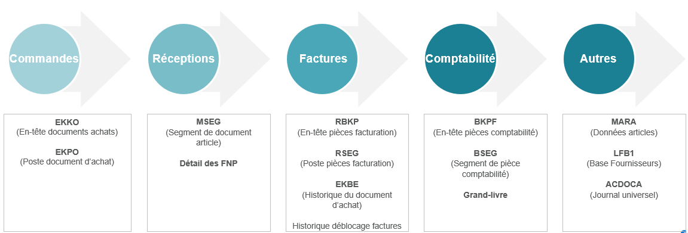
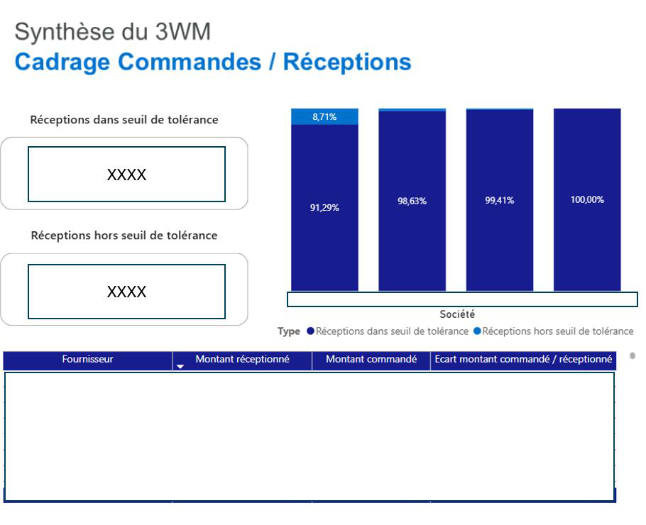
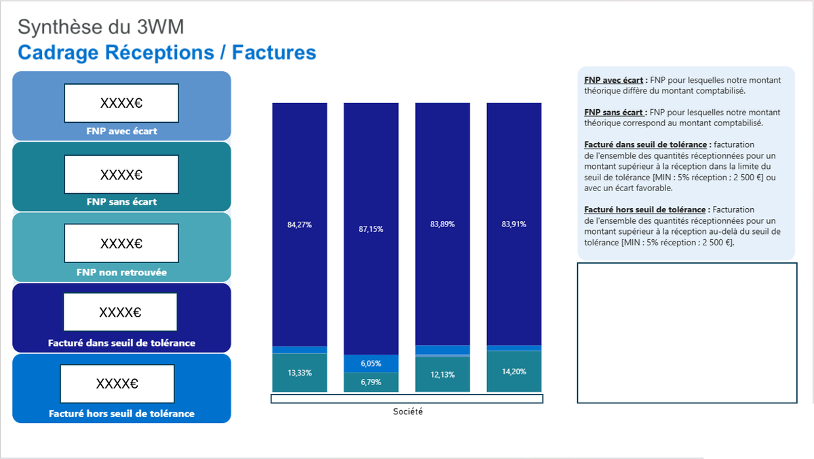

::: {.projet-meta}
[Alteryx]{.tag}
[Power BI]{.tag}
[SAP S/4HANA]{.tag}
[Procure-to-Pay]{.tag}
[Contrôle interne]{.tag}
:::

## Le problème

Un groupe industriel international traite **15 000 commandes par jour** sur SAP S/4HANA et Ariba, dans une organisation décentralisée. L'ERP est robuste, mais la direction financière n'a aucune vision transverse des engagements d'achats : impossible de dire, à un instant donné, où se creusent les écarts entre ce qui a été commandé, ce qui a été reçu et ce qui a été facturé.

Le suivi reposait sur des extractions Excel massives — plafonnées en nombre de lignes, exposées aux ruptures de formules et aux données non rafraîchies. SAP signale bien une facture bloquée, mais n'affiche pas d'un même écran l'historique de la commande et de la réception qui expliquent le blocage. S'y ajoute un référentiel hétérogène : des unités de mesure différentes entre la commande et la facture, qui fabriquent des écarts de quantité **fictifs**.

::: {.en-clair}
**En clair :** acheter, recevoir, payer sont trois événements enregistrés séparément dans le système. Tant que personne ne les rapproche ligne à ligne, une erreur peut traverser toute la chaîne sans que personne ne la voie.
:::

## L'approche

```
SAP S/4 HANA + Ariba — commandes, réceptions, factures
    └── Alteryx (ETL)
            ├── extraction     — 4 silos de tables SAP
            ├── normalisation  — prix ramenés à une unité commune
            ├── réparation     — comptes, flux, avoirs, exercices N-1
            ├── agrégation     — Summarize avant jointure
            └── moteur de règles — seuils 5 % / 2 500 €
    └── Power BI — schéma en étoile, rafraîchi à chaque exécution
```

{fig-alt="Schéma des tables SAP mobilisées : commandes EKKO/EKPO, réceptions MSEG, factures RBKP/RSEG/EKBE, comptabilité BKPF/BSEG, référentiels MARA/LFB1/ACDOCA."}

### Le 3-Way Match, et pourquoi il touche au bilan

::: {.bloc-technique}
Technique
:::

Le cycle Procure-to-Pay repose sur trois flux que SAP enregistre indépendamment : la **commande** (prix et quantité négociés), la **réception** (le service fait, qui mouvemente le stock et génère une écriture de *factures non parvenues*), la **facture** fournisseur. Le 3-Way Match consiste à les rapprocher exhaustivement, poste par poste.

L'apport d'un profil financier est là : une réception non facturée n'est pas un simple écart logistique, c'est une **FNP**, donc une dette au bilan. Un écart de prix sur un achat direct n'est pas une anomalie de fichier, c'est un point de marge industrielle.

::: {.en-clair}
**En clair :** un magasinier regarde si le camion est arrivé. Le comptable, lui, doit savoir combien l'entreprise devra payer pour ce camion, et l'inscrire dans ses comptes avant même de recevoir la facture. Le rapprochement des trois flux fait le lien entre les deux lectures.
:::

### Normaliser avant de comparer

::: {.bloc-technique}
Technique
:::

SAP stocke certains prix par lot de 100 ou de 1 000 unités — visserie, composants électroniques. Comparer directement un prix unitaire à un prix au millier produit un écart de **99 000 %** et rend le tableau de bord illisible. Une étape de normalisation systématique ramène chaque ligne à une unité de base commune avant tout calcul d'écart.

### Réparer les chaînes rompues

::: {.bloc-technique}
Technique
:::

Le workflow ne se contente pas de joindre des tables, il reconstitue l'information manquante :

- **Comptes comptables absents** sur certaines réceptions (`SAKTO` à NULL) : récupérés dans le journal universel `ACDOCA`, par rapprochement sur le numéro et le poste de commande.
- **Flux inter-entrepôts** : exclus, pour ne conserver que les entrées de marchandises réelles.
- **Réceptions et factures multiples** : une commande peut générer plusieurs réceptions partielles et plusieurs factures. L'agrégation intervient *avant* la jointure, pour éviter la multiplication des montants.
- **Avoirs** : traités en déduction des flux de facturation, pour piloter un reste-à-payer net.
- **Décalages d'exercice** : une réception en N-1 facturée en N produisait un faux écart ; les commandes pluriannuelles créées en N-2 et modifiées en N échappaient au rapprochement annuel. Les deux cas sont isolés et traités automatiquement.

::: {.en-clair}
**En clair :** la moitié du travail n'est pas de comparer, c'est de rendre les données comparables. Un écart affiché par le tableau de bord doit être un vrai problème métier, jamais un artefact de jointure — sinon plus personne ne le regarde.
:::

### Le moteur de règles

Les seuils ont été définis avec la direction financière, et l'analyse segmentée par nature d'achat : **achats directs** (préfixe SAP 47, matières entrant dans le coût de revient, donc impact marge) et **achats indirects** (préfixe 45, frais généraux, donc respect des budgets par service).

| Contrôle | Tolérance |
|---|---|
| Réception vs commande | ≤ 20 % de la quantité commandée |
| Écart de prix (facture) | > 5 % **et** > 2 500 € = anomalie |
| Écart de quantité (facture) | > 5 % **et** > 2 500 € = anomalie |

Chaque transaction tombe alors dans une catégorie : *facturé dans le seuil*, *facturé hors seuil*, *FNP sans écart* (la réception non facturée cadre avec le compte 408), *FNP avec écart* (elle ne cadre pas).

## Le résultat

{fig-alt="Tableau de bord Power BI comparant quatre sociétés : 91,29 % des réceptions dans le seuil de tolérance pour la première, contre 98,63 %, 99,41 % et 100 % pour les autres."}

Le premier écran a immédiatement isolé une **société atypique** : 8,71 % de ses réceptions hors seuil, quand les trois autres sont entre 98,6 % et 100 % de conformité. En descendant dans le détail, un cas limite est apparu :

| | Montant |
|---|---|
| Commande initiale | 4 000 € |
| Réception enregistrée | 35 000 000 € |
| Surévaluation de la FNP | > 34 996 000 € |

L'article était paramétré en **livraison illimitée** — aucun plafond de tolérance à la réception. Côté logistique, rien d'anormal ne se déclenche : le magasinier valide un flux, pas une valorisation. Côté comptable, la réception génère une dette potentielle, et tant que la facture n'arrive pas, cette dette reste inscrite en FNP.

{fig-alt="Tableau de bord Power BI par société : part des flux facturés dans le seuil de tolérance entre 83,89 % et 87,15 %, le solde en FNP et factures hors seuil."}

Le second écran a produit deux lectures qu'aucune extraction Excel ne donnait :

- **Les FNP avec écart** — les réceptions non facturées dont la valorisation ne cadre pas avec la comptabilité. Ce sont elles qui se corrigent avant clôture, par ajustement, régularisation de réception ou demande d'avoir. C'est du cut-off documenté.
- **Les fournisseurs qui saturent la tolérance** — en croisant, par tiers, le taux d'utilisation du seuil, la récurrence des écarts défavorables et le montant réceptionné. Une micro-surfacturation systématiquement calée juste sous 5 % ne déclenche jamais de blocage, mais devient matérielle en cumul. Le tableau de bord chiffre aussi l'impact des **déblocages** de factures hors seuil décidés par les opérationnels.

::: {.en-clair}
**En clair :** le seuil de tolérance est fait pour laisser passer les arrondis. Le tableau de bord regarde aussi ce qui passe *juste en dessous* du seuil, de façon répétée — précisément là où un contrôle par exception ne va jamais voir.
:::

## Limites

- **Aucun montant publiable.** Les chiffres du tableau de bord sont caviardés dans le rapport : je peux montrer les taux et le cas atypique, pas le montant total d'anomalies détectées ni le montant redressé.
- **Le rapprochement dépend du paramétrage SAP.** Des clés de tolérance mal réglées — la livraison illimitée du cas à 35 M€ — restent le vrai point de fragilité. Le tableau de bord les révèle, il ne les corrige pas.
- **Cadrage annuel par construction.** Réceptions N-1 et commandes pluriannuelles sont traitées par exception, pas nativement. Une logique de rapprochement en continu serait plus propre.
- **Périmètre incomplet.** Certains types d'achats ne font l'objet d'aucune réception ; ils sortent mécaniquement du 3-Way Match et doivent être contrôlés autrement.
- **Les prestations sont saisies à 1 € l'unité**, la quantité servant de proxy du montant et l'avancement se réceptionnant au prorata. La convention fonctionne, mais elle rend l'analyse quantitative sur ce périmètre peu interprétable.
- **Les seuils sont une convention, pas une vérité.** 5 % et 2 500 € résultent d'une négociation avec la direction financière. Déplacer le curseur change le volume d'anomalies à traiter — et donc la charge de travail des équipes.

## Pour aller plus loin

Deux prolongements : un rapprochement **en continu** plutôt qu'un cadrage annuel, qui supprimerait les retraitements d'exercice ; et un suivi de la **récurrence par fournisseur** dans le temps, pour transformer un constat de clôture en argument de renégociation contractuelle.

::: {.travail-meta}
Mission de conseil restituée dans mon deuxième rapport semestriel de stage DEC (décembre 2025), « Mise en place d'un tableau de bord ». Le client et le cabinet sont anonymisés ; les captures sont celles du rapport, montants et noms de fournisseurs caviardés à la source. Le workflow Alteryx et le modèle Power BI appartiennent au client : pas de dépôt public.
:::
